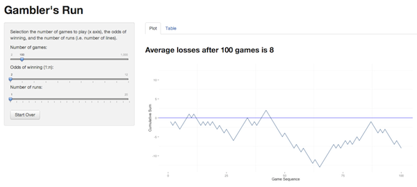

## Open Data Day 2018

Materials for brief workshop, Introduction to Shiny, given at the [Open Data Day](http://opendataalbany.org/) event on March 3, 2018.

* Slides: [Keynote](Slides/2018-03-01-IntroShiny.key), [PDF](Slides/2018-03-01-IntroShiny.pdf)
* [R script to run some Shiny apps](ShinyExamples.R)

## Shiny Apps

This repository hosts some [Shiny](http://rstudio.com/shiny) apps I have developed. The [`run.R`](https://github.com/jbryer/ShinyApps/blob/master/run.R) script can be used to get started.

First, install `shiny` and `shinyIncubator` packages, preferably the development versions.

	require(devtools)
	install_github('shiny', 'rstudio')
	install_github('shiny-incubator', 'rstudio')
	require(shiny)

* `gambler` - Simple app that lets you simulate a sequence of random events, for example coin flips, and plot the cummulative sum. This app allows you choose the odds of winning, the number of games to simulate, and the number of simulations to display simultaneously. 

	

	To run the app locally:
	
		shiny::runGitHub('ShinyApps', 'jbryer', subdir='gambler')

	Or from the [RStudio server](http://spark.rstudio.com/jbryer/gambler) (note that RStudio does not guarantee the server will always be up so this link may or may not work).
	
* `lottery` - Similar to the `gambler` app, this simulates buying a series of lottery tickets with varying odds of winning different amounts. Each previous run is saved and plotted in light grey to show how the current run compares to past runs.

	
	
	To run the app locally:
	
		shiny::runGitHub('ShinyApps', 'jbryer', subdir='lottery')

	Or from the [RStudio server](http://spark.rstudio.com/jbryer/lottery) (note that RStudio does not guarantee the server will always be up so this link may or may not work).
